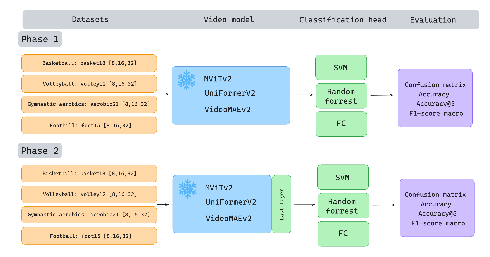

# Master's Thesis: **Action recognition in sport**

**Note:** This repository is an attachment to the author's master’s thesis. For a comprehensive analysis, complete methodology, and detailed results, please refer to the full thesis.

## Table of Contents

1. [Abstract](#abstract)
2. [Selected models](#selected-models)
3. [Datasets](#datasets)
4. [Experiments](#experiments)
5. [Results](#results)

# Abstract

The dynamic development of artificial intelligence, has meant that more and more solutions implemented into the area of everyday life, use its capabilities. In sports, solutions based on computer vision methods, aimed at processing data in the form of images or video, dominate. The subject of this work is the problem of action recognition, i.e. determining the type of behavior or situation that takes place in a sample video. 

The research performed focuses on comparing three video models - **UniformerV2**, **VideoMAEv2** and **MViTv2**, in terms of the quality of action classification in four sports: **basketball, volleyball, football and gymnastic aerobics**. Each of the architectures of the compared models is based on a vision transformer architecture - **ViT**. 

Thesis concludes with a summary of the results, the formulation of conclusions and the proposal of ideas in the continuation of further research.

# Selected models

The popularity of video classification in computer vision has led to a large number of publicly available models and their variants (over 200). In this study, we chose to limit the analysis to only three models meeting the following criteria:

* The selected models must be based on Vision Transformer (ViT) architecture, thus belonging to the broad category of transformer-based models.
* They must rely on a single modality – video (sequence of images).
* They achieved the highest accuracy scores on the Kinetics-400 dataset, which is the most widely used benchmark for video classification tasks.

Due to the limited computational resources available for the experiments, only the base version of each model family was considered. The models that met these criteria, achieving the top three accuracy scores on the specified dataset, were: **MViTv2**, **UniFormerV2**, and **VideoMAEv2**.

| Model                 | Pretrained | Accuracy [%] | Input Dimensions       |
|-----------------------|------------|--------------|------------------------|
| MViT-B          | -          | 80.2         | 32 x 3 x 224 x 224     |
| MViTv2-B         | -          | 82.9         | 32 x 3 x 224 x 224     |
| UniFormer-B      | IN         | 83.0         | 32 x 3 x 224 x 224     |
| UniFormerV2-B   | clip-K710  | 86.1         | 8 x 3 x 224 x 224      |
| Video Swin-B     | IN         | 80.6         | 32 x 3 x 224 x 224     |
| Video Swin-B          | IN21       | 82.7         | 32 x 3 x 224 x 224     |
| ViViT-B-LE       | K400       | 79.9         | 16 x 3 x 224 x 224     |
| MTV-B            | IN21       | 81.8         | 32 x 3 x 224 x 224     |
| VideoMAE (ViT-B)| K400       | 80.9         | 16 x 3 x 224 x 224     |
| VideoMAEv2 (ViT-B)| K710     | 86.6         | 16 x 3 x 224 x 224     |

**Table 1.** Comparison of models by accuracy on the Kinetics-400 dataset. IN - ImageNet, IN21 - ImageNet21K , K400 - Kinetics-400, K710 - Kinetics-710, clip-K710 - a reduced version of K710.

# Datasets

|                      | aerobic21 | basket18 | volley12 | foot15 |
|----------------------------|-----------|--------|----------|---------|
| Videos                     | 5606      | 6233   | 8224     | 4837    |
| Rescaling (%)              | 55%       | 19%    | 7%       | 9%      |
| Interpolation (%)          | 57%       | 83%    | 90%      | 96%     |
| Split (train/val/test)     | 4192/707/707      | 4524/854/855   | 6083/1070/1071     | 3546/645/646    |
| Split (train/val/test)  (%) | 75%/13%/13%      | 73%/14%/14%    | 74%/13%/13%      | 73%/13%/13%     ||
| Actions          | 21        | 18     | 12       | 15      |

# Experiments

The experimental procedure was divided into two main phases. In the first phase, the three selected video models—MViTv2, VideoMAEv2, and UniFormerV2—were treated as feature extractors, and their entire architecture was frozen. The extracted features came from the data space used in pretraining. Three types of classification heads were attached to each model: SVM, random forest, and a fully-connected (FC) layer.

In the first phase, only the classification heads were trained. For each head, specific hyperparameters were chosen based on the results obtained on the validation set. The addition of several head variants aimed to achieve the best possible classification results. The final step was to conduct a five-fold evaluation on the test set and to record the indicated metrics and their standard deviations in a file storing the experimental results.

In the second phase, the only difference in the operations performed was unfreezing the last layer of each video model and fine-tuning them on the trening set. 

The following metrics were used for result evaluation: accuracy, accuracy@5, f1-score macro, and confusion matrix. The confusion matrix was calculated after each evaluation iteration conducted on the test set. The final result was saved as a normalized and averaged confusion matrix from all iterations.

# Results

The results of the experiments can be found in the file `results/model_metric/model_metric.csv`.
